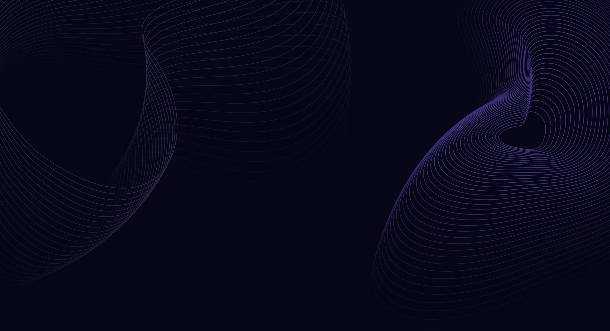

<div align="center">
  <h1>✨ Sagar Sharma — 3D Developer Portfolio</h1>
  <p>A modern, performant portfolio built with React, React Three Fiber, Vite, and Tailwind — deployed on Cloudflare Pages.</p>

<p>
    
    
    
    
    
    
  </p>

<p>
    
    
    
  </p>

<p>
    <a href="https://github.com/sagarsk04" target="_blank"></a>
    <a href="https://www.linkedin.com/in/sagarsh04/" target="_blank"></a>
       
    <a href="https://github.com/NICxKMS" target="_blank"></a>
    <a href="https://www.linkedin.com/in/nicx" target="_blank"></a>
  </p>

<br/>
  <em>Immersive 3D, buttery animations, and thoughtful performance — all in one place.</em>
</div>

---

### 🚀 Quickstart

```bash
# 1) Install
npm install

# 2) Configure EmailJS
cp sag.env .env  # then fill VITE_EMAILJS_* vars

# 3) Run locally
npm run dev   # http://localhost:5173

# 4) Production build + preview
npm run build && npm run preview  # http://localhost:4173
```

---

### 🧭 What’s inside

- ✨ 3D hero (desktop), starfield, and rotating Earth
- 🎬 Smooth transitions via Framer Motion and a clean Section HOC
- ⚡ Lazy-loaded sections/canvases for fast first paint
- 📦 Meshopt-compressed 3D models for quick downloads and decode
- 🧱 Optional KTX2 textures with automatic fallback
- ☁️ Cloudflare Pages headers + SPA redirects for edge-cached delivery

---

### 🗂️ Structure

```
src/
  components/
    About.jsx, Works.jsx, Contact.jsx, ...
    canvas/
      Computers.jsx, Earth.jsx, Stars.jsx
  constants/          # nav, projects, tech
  hoc/                # SectionWrapper
  utils/              # motion variants
public/
  _headers            # caching + security headers
  _redirects          # SPA fallback (/* -> /index.html)
  desktop_pc/         # hero model(s)
  planet/             # earth model(s)
```

---

### ⚙️ Configuration

- Create `.env` with EmailJS keys:

```env
VITE_EMAILJS_SERVICE_ID=your_emailjs_service_id
VITE_EMAILJS_TEMPLATE_ID=your_emailjs_template_id
VITE_EMAILJS_PUBLIC_KEY=your_emailjs_public_key
```

- Vite config includes:
  - Vendor chunking + pre-bundling
  - Mode-aware minification and console stripping (prod)
  - `@` alias → `src`
  - Visualizer (gzip/brotli) report in `dist/bundle-stats.html`

---

### 📊 At‑a‑glance

| Area | Visual | Details |
|---|---|---|
| Hero 3D | 🖥️ | Desktop model with orbit controls (zoom disabled) |
| Background | ✨ | Animated starfield using R3F Points + maath |
| Earth 3D | 🌍 | Auto-rotating Earth, mounts on visibility |
| Animations | 🎬 | Framer Motion variants + Section HOC |
| Styling | 🎨 | Tailwind theme, gradients, utilities |
| Hosting | ☁️ | Cloudflare Pages + Edge caching |

### 🧰 Tech stack

| Layer | Tools |
|---|---|
| UI | React 18, Tailwind CSS |
| 3D | Three.js, React Three Fiber, Drei |
| Animations | Framer Motion |
| Build | Vite 4, Rollup visualizer |
| Email | EmailJS |
| Hosting | Cloudflare Pages |

### 🧪 Commands

| Command | Purpose |
|---|---|
| `npm run dev` | Start Vite dev server |
| `npm run build` | Production build to `dist/` |
| `npm run preview` | Preview production build |

### 🔐 Env vars

| Variable | Description |
|---|---|
| `VITE_EMAILJS_SERVICE_ID` | EmailJS service ID |
| `VITE_EMAILJS_TEMPLATE_ID` | EmailJS template ID |
| `VITE_EMAILJS_PUBLIC_KEY` | EmailJS public key |

### ⚡ Performance checklist

| Optimization | Status |
|---|---|
| Lazy-load non-critical sections | ✅ |
| Lazy-load 3D canvases | ✅ |
| DPR set to 1 for canvases | ✅ |
| powerPreference: high-performance | ✅ |
| Earth mounts on view (IO) | ✅ |
| Meshopt-compressed `.glb` | ✅ |
| Optional KTX2 with fallback | ✅ (auto-detect) |
| Cloudflare `_headers` caching | ✅ |
| SPA `_redirects` | ✅ |

---

### 🧩 3D pipeline

- Baseline (used now): Meshopt `.glb`

```bash
npm i -D gltfpack
npx gltfpack -i public/desktop_pc/scene.gltf -o public/desktop_pc/scene.glb -c -kn
npx gltfpack -i public/planet/scene.gltf     -o public/planet/scene.glb     -c -kn
```

- Optional (future): KTX2 textures

```bash
# Requires native gltfpack (BasisU)
gltfpack -i public/desktop_pc/scene.gltf -o public/desktop_pc/scene.ktx2.glb -c -tc -kn
gltfpack -i public/planet/scene.gltf     -o public/planet/scene.ktx2.glb     -c -tc -kn
# Commit files — the app will auto-use them, else fallback to .glb
```

---

### 🐞 Troubleshooting

- ⏳ Stuck at ~94%: ensure Meshopt `.glb` models and hard refresh
- 🧩 Meshopt error: loaders call `setMeshoptDecoder(...)` per instance; avoid early preloads
- 🔎 404 HEAD `scene.ktx2.glb`: expected unless KTX2 files exist; fallback continues
- ♻️ Multiple React copies: dedupe and chunking handled in `vite.config.js`

---

<div align="center">
  
  <p><sub>Beautiful gradient theme, smooth motion, and crisp 3D assets.</sub></p>
</div>

---

### 📣 Credits

- 3D rendering: Three.js + React Three Fiber + Drei
- Animations: Framer Motion
- Hosting: Cloudflare Pages

### 📜 License

This repository contains the code for Sagar Sharma’s portfolio. You’re welcome to learn from it and adapt with attribution.

---

### 👥 Contributors

- Created by: **Sagar Sharma** — MERN Stack Developer

  <a href="https://github.com/sagarsk04" target="_blank"></a>
  <a href="https://www.linkedin.com/in/sagarsh04/" target="_blank"></a>
- Improved by: **Nikhil Kumar** — Performance & 3D Optimization

  <a href="https://github.com/NICxKMS" target="_blank"></a>
  <a href="https://www.linkedin.com/in/nikhil-nicx-sagar" target="_blank"></a>

You can review detailed changes in Git history (commit authorship).

### 🧾 Changelog (highlights)

- @Initial commit — project scaffold and core sections (Sagar)
- @Update — version bump in `package.json` from `0.0.0` → `1.0.0` (Nikhil)
- @Refactor — GLTF loading in `Computers.jsx` and `Earth.jsx` to support KTX2 format and `MeshoptDecoder`; remove unused Meshopt registration in `main.jsx` and preload logic in `Hero.jsx` (Nikhil)

---

### 🧑‍💻 Detailed Contributions

| Role | Author | Links | Key Areas |
|---|---|---|---|
| Creator | **Sagar Sharma** | [GitHub: sagarsk04](https://github.com/sagarsk04) • [LinkedIn](https://www.linkedin.com/in/sagarsh04/) | Project scaffold, core sections (`Hero`, `Navbar`, `About`, `Tech`, `Works`, `Feedbacks`, `Contact`), motion system (`utils/motion.js`), `SectionWrapper` HOC, Tailwind theme and assets, initial R3F canvases (`Computers`, `Earth`, `Stars`), EmailJS contact flow, content/constants |
| Improvements | **Nikhil Kumar** | [GitHub: NICxKMS](https://github.com/NICxKMS) • [LinkedIn](https://www.linkedin.com/in/nicx) | Performance + UX, GLTF loader refactors (Meshopt + KTX2 fallback), lazy-loading strategy, Earth IO-gated mount, Vite build tuning, Cloudflare headers/redirects, preconnects, env hardening, README overhaul |

#### Contributions Matrix (by file/area)

| Component / File | Author | Change Type | Summary |
|---|---|---|---|
| `src/components/*` (core) | Sagar | Feature | All UI sections, styles, and constants content; initial Drei/R3F scenes |
| `src/components/Navbar.jsx` | Sagar | UX | Scroll-aware nav, mobile menu toggle, active link state, anchor routing |
| `src/components/About.jsx` | Sagar | UI | Service cards with Tilt, section copy, motion sequencing |
| `src/components/Tech.jsx` | Sagar | 3D UI | Skill icons via `BallCanvas` decals (floating, orbit controls disabled) |
| `src/components/Works.jsx` | Sagar | UI | Project cards (Tilt, tags, descriptions), responsive grid |
| `src/components/Feedbacks.jsx` | Sagar | UI | Testimonial cards with motion, avatar, designation/company |
| `src/constants/index.js` | Sagar | Content | Nav links, services, tech, experiences, testimonials, projects data |
| `src/index.css` | Sagar | Global styles | Gradients, text utilities, canvas loader keyframes, resets |
| `public/*` assets | Sagar | Assets | Favicon/logo, background, curated images/icons |
| `src/utils/motion.js`, `src/hoc/SectionWrapper.jsx` | Sagar | Architecture | Reusable variants and Section HOC for consistent animation/anchors |
| `tailwind.config.cjs`, `src/styles.js` | Sagar | Theme | Tailwind theme extension, gradients, typography scales |
| `src/components/*` (bugfixes) | Sagar | Fixes | Minor UI/styling adjustments, anchor/link tweaks, asset path corrections, and content fixes prior to optimization phase |
| `src/components/canvas/Computers.jsx` | Nikhil | Refactor | Switch to `.glb` with Meshopt; add per-loader `setMeshoptDecoder`; optional KTX2 via `KTX2Loader` and CDN transcoder; DPR=1 and high-performance GL context |
| `src/components/canvas/Earth.jsx` | Nikhil | Refactor | Same loader strategy; Earth canvas auto-rotating; mounts with IO in `Contact.jsx` |
| `src/components/canvas/Stars.jsx` | Nikhil | Perf | Lower DPR and streamlined canvas preload behavior |
| `src/components/Hero.jsx` | Nikhil | Cleanup | Removed early `useGLTF.preload` and lazy-load `ComputersCanvas` to avoid pre-config decode |
| `src/components/Contact.jsx` | Nikhil | UX/Perf | IntersectionObserver gate for Earth; form remains EmailJS-driven |
| `src/App.jsx` | Nikhil | Code-split | `React.lazy` + `Suspense` for sections (`About`, `Tech`, `Works`, `Feedbacks`, `Contact`, `StarsCanvas`) |
| `src/main.jsx` | Nikhil | Loader config | Removed global Meshopt registration to prefer per-loader configuration (avoids runtime mismatch) |
| `index.html` | Nikhil | Networking | Preconnect + dns-prefetch for Fonts and EmailJS; favicon/title retained |
| `vite.config.js` | Nikhil | Build | Vendor chunking, `dedupe` react/dom, module preload tuning, prod console/debugger drop, visualizer (gzip/brotli) |
| `public/_headers` | Nikhil | Edge caching | Security headers + cache strategy (immutable assets, 7‑day GLTF/images, HTML no-cache) |
| `public/_redirects` | Nikhil | SPA | Fallback `/* → /index.html 200` |
| `sag.env` | Nikhil | Config | `VITE_EMAILJS_*` variables documented for Pages |
| `README.md` | Nikhil | Docs/Visuals | Full restructure with visuals, badges, tables, pipeline, troubleshooting, contributors |

#### Highlights by Area

| Area | Contributions |
|---|---|
| Performance | Lazy-load non-critical sections and 3D canvases; DPR=1; `powerPreference: 'high-performance'`; demand frameloop; reduced initial JS |
| 3D Pipeline | Meshopt `.glb` models (fix 94% stalls); per-loader `setMeshoptDecoder(...)`; optional KTX2 auto-detect via HEAD with `KTX2Loader` + CDN transcoder; removed early preload to respect Meshopt setup |
| Hosting/Build | Cloudflare Pages `_headers` (security + caching) and `_redirects` (SPA); Vite vendor chunking + dedupe; disable modulePreload polyfill; prod console/debugger stripping; bundle visualizer |
| UI/UX & Content | Sagar: responsive sections, Tilt cards, testimonials, skills UI, navigation UX, copywriting; Nikhil: deferred Earth mount, loader polish, section loading UX |
| DX & Docs | Env migration to `VITE_*`; README restructured (quickstart, deploy, performance, 3D pipeline, troubleshooting) |

#### Mini Timeline

| Milestone | Author | Notes |
|---|---|---|
| Initial scaffold | Sagar | Core sections, motion system, first-pass 3D scenes, Tailwind theme |
| Responsive & content pass | Sagar | Copy, cards, gradients, and responsive tweaks across sections |
| Initial bugfixes & polish | Sagar | Minor UI/styling and content fixes before optimization phase |
| Meshopt adoption | Nikhil | Convert `.gltf` → `.glb` Meshopt; remove long parse stalls |
| Code-splitting pass | Nikhil | Lazy sections + canvases; IO-gated Earth |
| Cloudflare polish | Nikhil | `_headers`, `_redirects`, preconnects, env setup |
| README+docs | Nikhil | Visual, tables, troubleshooting, pipeline |

#### Commit Tag Legend

| Tag | Meaning |
|---|---|
| `@Initial commit` | Scaffold and core features (Sagar) |
| `@Update` | Version bump `0.0.0 → 1.0.0` (Nikhil) |
| `@Refactor` | GLTF loading for KTX2 + Meshopt; removed unused Meshopt registration and preload (Nikhil) |
